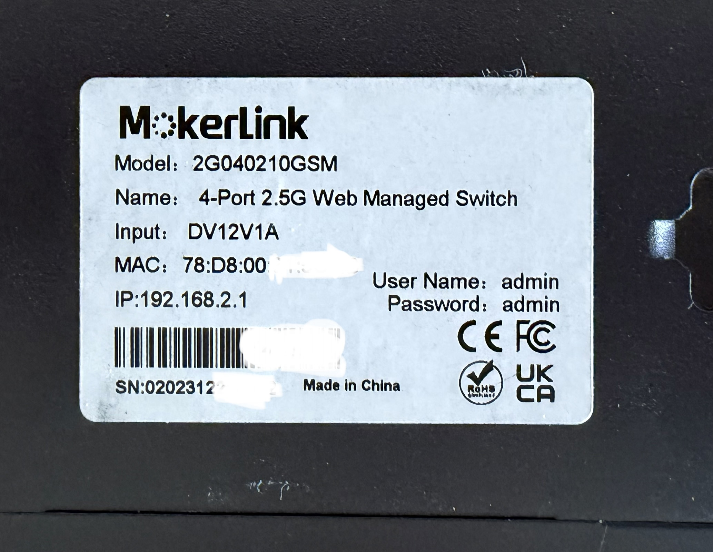
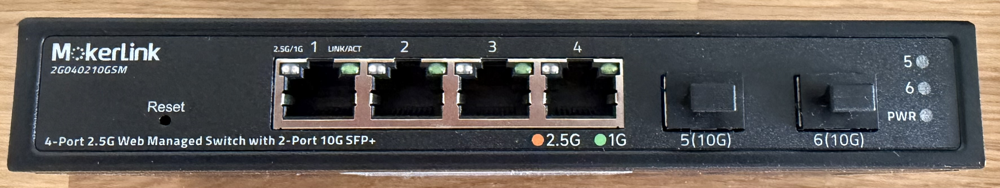
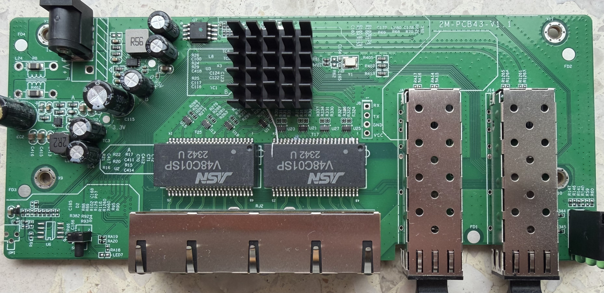
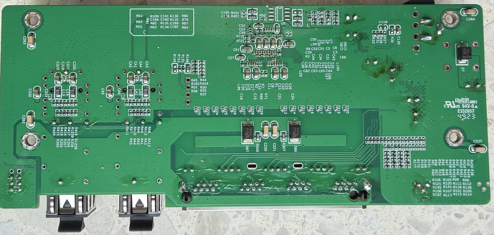

# 2G040210GSM

The following is a documentation for the managed switch marked as `2G040210GSM`
and sold by Mokerlink.

### Label specifications

- **Name**: 4-port 2.5G Web Managed Switch
- **Ports**:
  - 4 × RJ45: 10/100/1000/2500 Mbps
  - 2 × SFP+: 1000 / 2500 / 10000 Mbps
- **Power**: 12V DC, 1A barrel connector 

### What works
The device is fully supported:
- All 4 2.5GBASE-T RJ45 ports work at 10/100/1000/2500 Mbps
- The SFP+ port supports 1G, 2.5G and 10G modules 
- LEDs work with the same indiciations as the OEM firmware (use KP_9000_6XHML_X2 in machine.h if building yourself or the corresponding pre-compiled binary)
- untested due to missing Hardware: SFP+ ports equipped with 1G or 2.5G SFPs.

### Hardware overview
Front

Label

### PCB overview

**Board markings**
- Top silkscreen: 2M-PCB43-V1.1

Top side

Bottom

### J1, serial console

| `J8` pin | Signal      |
| -------- | ----------- |
| 1        | RX (Input)  |
| 2        | TX (Output) |
| 3        | GND         |
| 4        | 3V3         |

## Power supply

Input power is delivered via barell plug, `12V 1A` adapter was provided.
