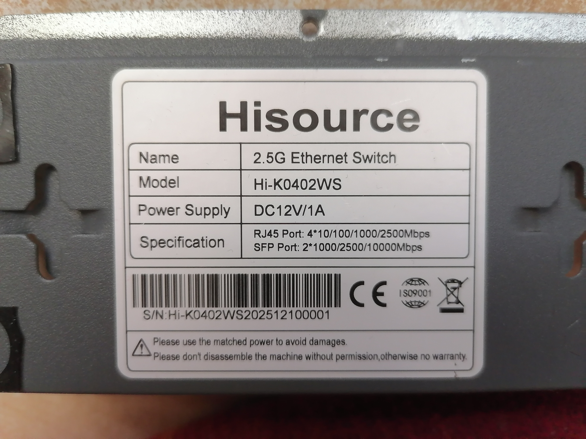
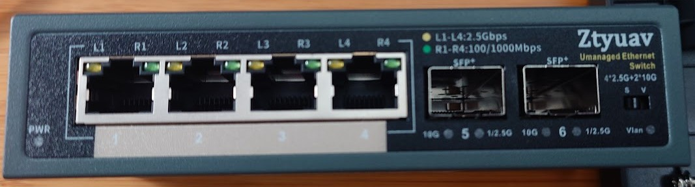
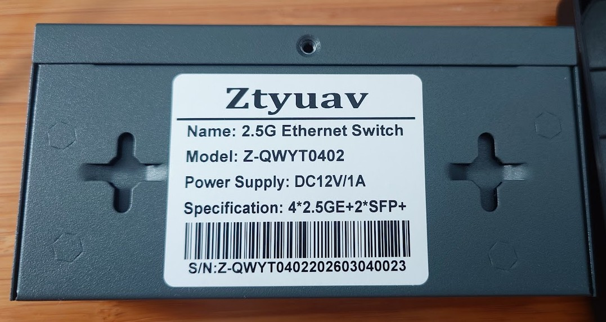
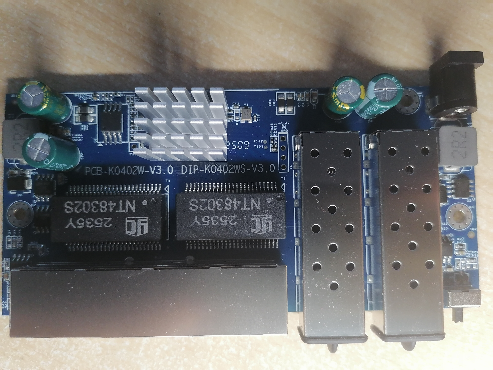
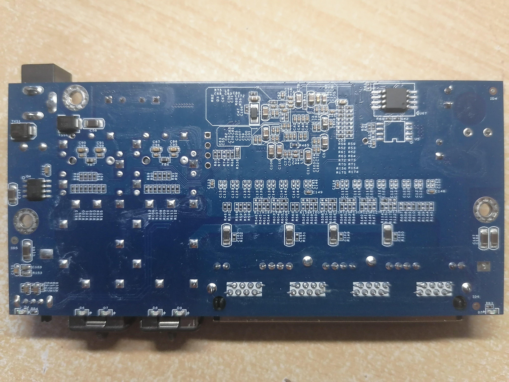

# PCB-K0402WS-V3.0

Following is documentation for a variety of unmanaged switch internally marked as `PCB-K0402WS-V3.0`. They are sold under many brands.

Original software is running UART on 9600 baud rate.

Note during opening the device: there might be a hidden 5th screw on the back
of the device just above the big label, might be covered by a QC sticker.

### Brands

* Hisource Hi-K0402WS

* Ztyuav Z-QWYT0402

### Programming

Using SPI clamp in-board is the only method for initial installation.

The board has two flash chips `BY25Q16BS` with 16M-bit size. The front switch, switches between the two flash chips.
These can be programed independently by using said switch - so it is e.g. possible to run the original and new firmware in parallel.
The switch actually controls the HOLD line of each flash chip, and toggling the switch results in a reboot.

If the programming clip keeps HOLD not connected, the flashing will commence on whatever the switch selected, regardless on which chip was clipped.

For the initial flash (at least with flashrom), the bin file produced by the build is much smaller than the flash chip, it is suggested to pad the file to keep flashrom happy: `truncate -s 2097152 rtlplayground-*-PCB_K0402WS_V3.bin`. Note: do not then proceed to use this resulting padded file for the web flashing (as it bricks the device), use the original unpadded .bin.

### What works (expected from label + similar devices)

- All four 2.5GBASE-T RJ45 ports at 10/100/1000/2500 Mbps  
- Both SFP ports supporting 1G, 2.5G and 10G modules 
- LEDs

### PCB overview

**Board markings**  
- Top silkscreen: PCB-KO4022W-V3.0 / DIP-KO4022WS-V3.0  

Top side

Bottom

### T2, serial console

| `J2` pin | Signal      |
| -------- | ----------- |
| 1        | 3V3         |
| 2        | RX (Input) |
| 3        | TX (Output)  |
| 4        | GND         |

## Power supply

Input power is delivered via barell plug, `12V 1A` adapter was provided.
Board has two supply rails. `0.95` and `3.3` volt.

### `0.95` Core Voltage

Voltage is made by a `Techcode TD1720` .

### `3.3` Voltage

Voltage is created by chip marked as `Techcode TD1720`.

**There seems to have been a miscalculation when choosing the inductor and the device is ~25% more efficient with an 5V power supply.**
